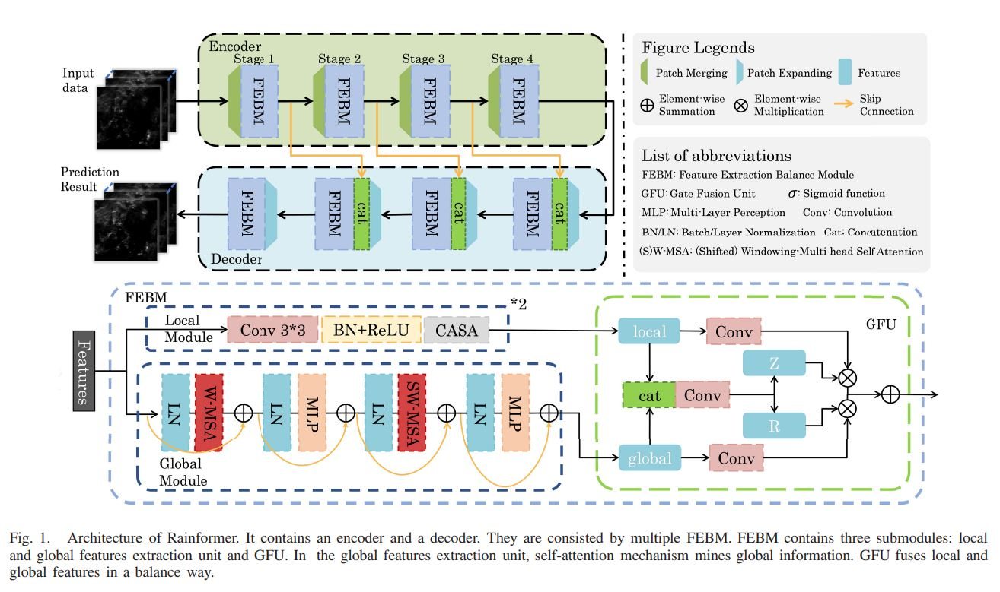

[ENGLISH](README.md) | 简体中文

# 基于雷达短临降水预报的特征提取平衡网络：Rainformer

## 概述

Rainformer是一种新的短临降水框架，由两个实用组件构成：全局特征提取单元和门融合单元（GFU）。其中前者依靠基于窗口的多头注意力机制提供了强大的全局特征学习能力，而后者提供了局部和全局特征的平衡融合。Rainformer具有简单而高效的架构，显著提高了降水预测，尤其是高强度降水的准确性。它为现实世界中的短临降水预测提供了一个潜在的解决方案。

本教程介绍了Rainformer的研究背景和技术路径，并展示了如何通过MindEarth训练和快速推断模型。

更多信息可以在[原始论文](https://ieeexplore.ieee.org/abstract/document/9743916)中找到。

## 快速开始

数据集由2016年至2019年中间隔5分钟的降雨雷达图组成，共包含约42万张图片。

数据集是基于荷兰皇家气象研究所的降雨雷达图数据。

要下载此数据集，可向数据集作者[k.trebing@alumni.maastrichtuniversity.nl](k.trebing@alumni.maastrichtuniversity.nl)和[s.mehrkanoon@uu.nl](s.mehrkanoon@uu.nl)发邮件询问下载链接。

请将原始数据下载至`./dataset`目录中，并使用`./dataset/create_dataset.py`来建立数据集。

### 训练方式一：在命令行中调用`main.py`脚本

### 训练方式二：运行Jupyter Notebook

## 结果展示

## Contributor

gitee id: bingzhi.li 
email: bingzhi.li@zhejianglab.com 
